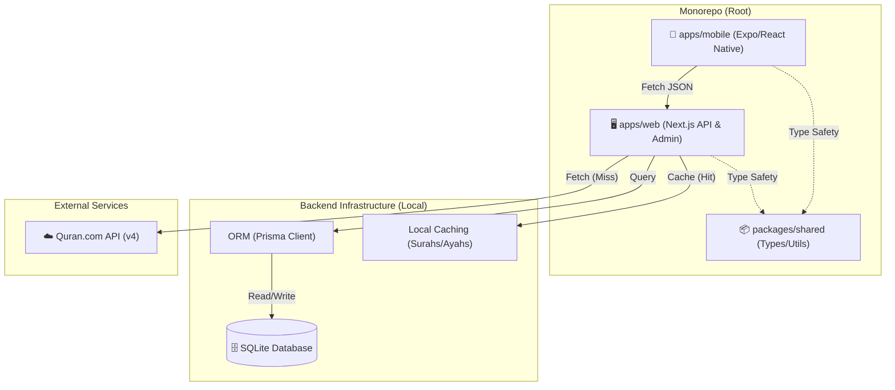

# QuranLingo

**QuranLingo** is a full-stack learning platform designed to help users master Quranic Arabic through interactive lessons, spaced repetition, and direct engagement with the Quranic text.


## 🏗 System Architecture

The project is structured as a **Monorepo** using npm workspaces, ensuring shared logic and type safety across web and mobile platforms.



### 🛠 Tech Stack

| Component | Technology | Description |
|-----------|------------|-------------|
| **Core** | **TypeScript** | Strict type safety across the entire repo. |
| **Monorepo** | **NPM Workspaces** | Efficient dependency management. |
| **Web / Backend** | **Next.js 15+** | Serves the Admin UI and the REST API. |
| **Mobile** | **Expo / React Native** | Cross-platform mobile app (iOS/Android). |
| **Database** | **SQLite** | Local file-based DB for easy development (setup-free). |
| **ORM** | **Prisma** | Database schema management and type-safe queries. |
| **State/Fetch** | **TanStack Query** | Async state management and caching on Mobile. |
| **Styling** | **Tailwind CSS** | Used in Web; (NativeWind planned for Mobile). |

---

## 🚀 Getting Started

Follow these steps to set up the project locally.

### Prerequisites

*   **Node.js**: v18+ installed.
*   **Mobile Simulators**:
    *   **iOS**: Xcode (Mac only).
    *   **Android**: Android Studio.

### 1. Installation

Clone the repo and install dependencies:

```bash
git clone <repo-url>
cd QuranLingo
npm install
```

### 2. Database Setup

We use **SQLite** for local development, so no external database installation is needed.

```bash
# Generate Prisma Client
npm run db:generate --workspace=apps/web

# Push schema to local SQLite file (dev.db)
npm run db:push --workspace=apps/web

# Seed initial data (Courses, Lessons, Surahs)
npm run db:seed --workspace=apps/web
```

### 3. Running the Backend

The backend **MUST** be running for the mobile app to work. It serves the API at `http://localhost:3000`.

```bash
# Terminal Tab 1
npm run dev --workspace=apps/web
```
*   Verify at: `http://localhost:3000` (Should see "QuranLingo API & Admin")
*   Verify API: `http://localhost:3000/api/lesson/next`

### 4. Running the Mobile App

Open a **new terminal tab** to run the Metro Bundler.

```bash
# Terminal Tab 2
cd apps/mobile

# For iOS Simulator
npm run ios

# For Android Emulator
npm run android
```

> **Note**: If you are using a physical device or a different network, you may need to update `apps/mobile/constants/api.ts` with your machine's local IP address (e.g., `http://192.168.1.X:3000`).

---

## 🧪 Testing

### Manual Testing
*   **Lesson Flow**: Launch app -> "Start Learning" -> Select answers -> Verify completion alert.
*   **Read Mode**: Launch app -> "Read Quran" -> Verify Arabic text and header toggle.

### Debugging
*   **Backend Logs**: Check Terminal Tab 1 for API request logs (`GET /api/lesson/next`, `FETCH Surah...`).
*   **Database**:
    *   Run `npx prisma studio --workspace=apps/web` to open a GUI for the SQLite database.

## 📂 Project Structure

```text
QuranLingo/
├── apps/
│   ├── mobile/         # Expo App
│   │   ├── screens/    # UI Screens (Lesson, Read, Home)
│   │   ├── services/   # API Clients
│   │   └── App.tsx     # Navigation Entry
│   └── web/            # Next.js App
│       ├── app/api/    # API Routes (/quran, /lesson)
│       ├── prisma/     # Schema & Seed
│       └── lib/        # Shared Server Logic
├── packages/
│   └── shared/         # Shared Types/Contants
└── package.json        # Root Scripts
```

## 🧠 Learning Philosophy
*   **80/20 Rule**: We focus on the most frequent 20% of words that make up 80% of the Quranic text (Pareto Principle).
*   **Ayah-Centric**: Words are never learned in isolation; they are always presented in the context of a meaningful Ayah.
*   **Direct Engagement**: The goal isn't just to memorize words, but to be able to *read* and *understand* the Mushaf immediately.
*   **Spaced Repetition**: An intelligent algorithm ensures you review words right before you are likely to forget them.

## 🏆 Course Completion Certificate
*   **Verifiable Proof**: Upon completing a full course (e.g., "Quranic Foundations"), users receive a generated PDF certificate.
*   **Unique ID**: Each certificate has a unique, publically verifiable URL (e.g., `quranlingo.com/cert/uuid`).
*   **Motivation**: Serves as a tangible milestone to encourage users to finish the curriculum.
*   **Sharing**: Designed to be shared on social media or LinkedIn to celebrate the achievement.

## ⚖️ Balanced Gamification Model
*   **Purposeful**: Gamification supports the habit, it doesn't distract from the sacred content.
*   **Streak System**: Tracks consecutive days of learning to build consistency (the most important factor in language acquisition).
*   **XP & Levels**: "Barakah Points" measure effort, not just correctness.
*   **No "Lives"**: We do not punish mistakes. Learning the Quran should be stress-free and encouraging.

## 🗺️ Post-MVP Roadmap
*   **Audio Recitation**: Tap any word/ayah to hear professional recitation (Mishary, Husary).
*   **Community Features**: "Classrooms" for families or study groups to track collective progress.
*   **Tafseer Integration**: Deep dive into meanings with integrated Tafseer (Ibn Kathir, Jalalayn).
*   **AI Tutor**: Chat interface to ask grammatical questions about specific verses.
*   **Dark Mode**: Full support for night-time reading and learning.
